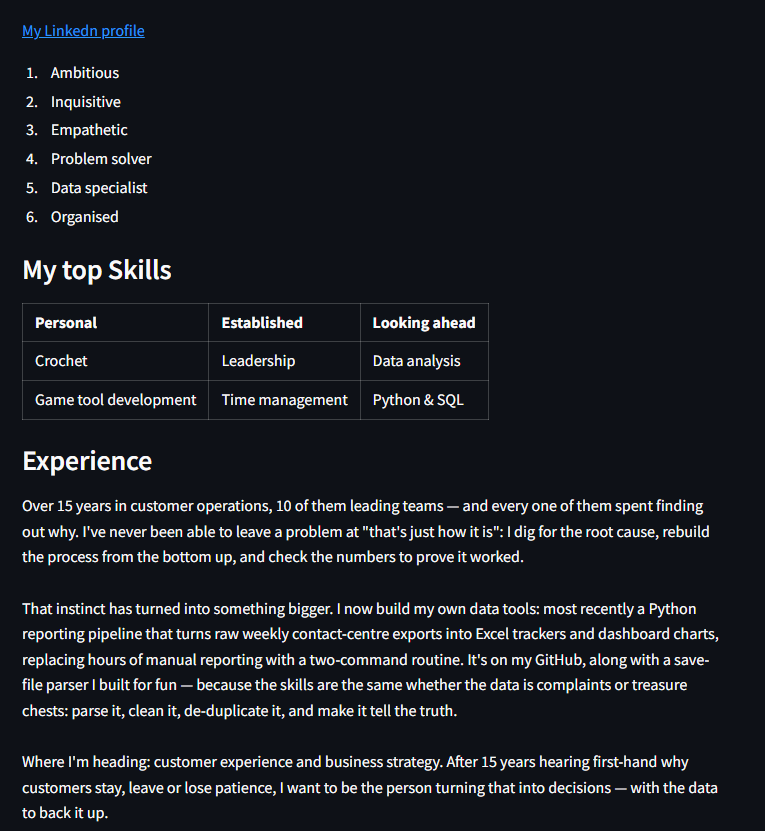

# Streamlit Course

My notes, exercises, and challenge solutions from Andy Bek's Streamlit course (andybek.com), tracked as I work through it.

## What's in here

- `app.py` — main working file for whatever section I'm currently on
- `challenge1.py` — Challenge 1: a personal bio page built with `st.image`, `st.markdown`, and a markdown table
- `Section2-notes.md` — notes and learnings from Section 2 (environment setup, markdown, images)
- `.gitignore` — excludes the virtual environment and course resource downloads

## Bio page (Challenge 1)

A one-page profile built entirely in Streamlit: photo, LinkedIn link, key strengths, a skills table, and full work experience — no HTML/CSS required.



## Tech

- Python
- [Streamlit](https://streamlit.io/)

## Running locally

```powershell
python -m venv env
.\env\Scripts\Activate.ps1
pip install streamlit
streamlit run app.py
```

## Progress

- [x] Section 1 — Setup
- [x] Section 2 — Environment, Markdown, Images (Challenge 1: Bio page)
- [ ] Section 3
